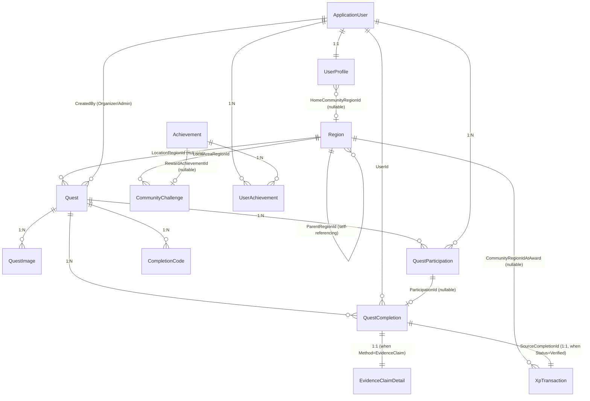

# Core Domain Data Model

- **Status:** Accepted
- **Date:** 2026-07-21
- **Purpose:** Define the complete Kiwimpact core domain data model including entities, relationships, constraints, indexes, and ownership boundaries for MVP implementation.
- **Scope:** All MVP entities and their database-level constraints. Does not define DTOs, API contracts, or UI components.

> This document records accepted data model direction. It does not claim that migrations, EF Core configuration, or seed data have been implemented. The canonical schema history lives in EF Core migration files in `Kiwimpact.Infrastructure`.

## 1. Terminology

| Term | Definition |
|------|-----------|
| Quest | An environmental activity that Members can discover, join, and complete |
| QuestCompletion | The canonical record that a Member completed a Quest, via any Method |
| CompletionCode | A reusable code issued by an Organizer that eligible Members redeem to create a verified QuestCompletion |
| EvidenceClaimDetail | Structured evidence submitted by a Member claiming completion of an external Quest; 1:1 with QuestCompletion when Method=EvidenceClaim |
| XpTransaction | An immutable ledger entry recording XP awarded for one verified QuestCompletion |
| CommunityChallenge | A time-bound monthly challenge for a LocalArea, tracking collective verified completion count |
| Home Community | The coarse-grained LocalArea a Member optionally selects for community identity and leaderboard scoping |
| Passport | The Member's personal record containing Completion History and Community Participation |

## 2. Entity-Relationship Diagram (Mermaid)



## 3. Entity and Field Tables

### 3.1 ApplicationUser (ASP.NET Core Identity)

Managed by ASP.NET Core Identity. Not defined here in detail. Key relationships:

- 1:1 with `UserProfile` via `Id`
- 1:N with `Quest` (as Organizer/Admin creator)
- 1:N with `QuestParticipation`
- 1:N with `QuestCompletion` (as completer)
- 1:N with `UserAchievement`

### 3.2 UserProfile

| Column | Type | Constraints |
|--------|------|-------------|
| `Id` | `uuid` | PK, FK → `AspNetUsers.Id` |
| `DisplayName` | `text` (max 100) | Not null |
| `HomeCommunityRegionId` | `uuid?` | Nullable. FK → `Region.Id`. Restrict delete. |
| `ShowCommunityOnPassport` | `bool` | Not null, default `false` |
| `LastCommunityChangeAt` | `timestamp with time zone?` | Nullable. Set when Home Community is changed (not first selection). Used for cooldown enforcement. |
| `CreatedAt` | `timestamp with time zone` | Not null |
| `UpdatedAt` | `timestamp with time zone` | Not null |

### 3.3 Region

See `specs/architecture/01-domain-model-region.md` for full specification.

| Column | Type | Constraints |
|--------|------|-------------|
| `Id` | `uuid` | PK, not null |
| `Name` | `text` (max 200) | Not null |
| `Type` | `text` (max 50) | Not null. Stores `RegionType` enum as string. |
| `ParentRegionId` | `uuid?` | Nullable. FK → `Region.Id`. Restrict delete. |
| `IsActive` | `bool` | Not null, default `true` |
| `CreatedAt` | `timestamp with time zone` | Not null |
| `UpdatedAt` | `timestamp with time zone` | Not null |

**RegionType enum:** `Country`, `AdministrativeArea`, `LocalArea`

### 3.4 Quest

| Column | Type | Constraints |
|--------|------|-------------|
| `Id` | `uuid` | PK, not null |
| `Title` | `text` (max 200) | Not null |
| `Description` | `text` (max 2000) | Not null |
| `Category` | `text` (max 50) | Not null. Stores `QuestCategory` enum as string. |
| `Status` | `text` (max 50) | Not null. Stores `QuestStatus` enum as string. |
| `SourceType` | `text` (max 50) | Not null. Stores `QuestSourceType` enum as string. |
| `RegistrationMode` | `text` (max 50) | Nullable for External source. Stores `RegistrationMode` enum as string. |
| `Difficulty` | `text` (max 50) | Not null. Stores `QuestDifficulty` enum as string. |
| `XpAward` | `int` | Not null, ≥ 0. Server-calculated; frontend never submits XP value. |
| `Capacity` | `int?` | Nullable. Null = unlimited. |
| `StartAtUtc` | `timestamp with time zone?` | Nullable |
| `EndAtUtc` | `timestamp with time zone?` | Nullable |
| `LocationRegionId` | `uuid?` | Nullable. FK → `Region.Id`. Restrict delete. |
| `LocationDescription` | `text` (max 500) | Nullable |
| `ExternalSourceUrl` | `text` (max 2000) | Nullable. HTTPS only. |
| `ExternalSourceStatus` | `text` (max 50) | Nullable for non-External source. Stores `ExternalSourceStatus` enum. |
| `SourceCheckedAt` | `timestamp with time zone?` | Nullable |
| `NextCheckDueAt` | `timestamp with time zone?` | Nullable |
| `CreatedByUserId` | `uuid` | Not null. FK → `AspNetUsers.Id`. |
| `CreatedAt` | `timestamp with time zone` | Not null |
| `UpdatedAt` | `timestamp with time zone` | Not null |

**QuestCategory enum:** `RestoreNature`, `ProtectWildlife`, `CleanReduceWaste`, `GrowCompost`, `ObserveMeasure`, `LearnShare`

**QuestStatus enum:** `Draft`, `Published`, `Cancelled`, `Archived`

**QuestSourceType enum:** `OrganizerOwned`, `AdminCuratedExternal`, `PlatformEcoChallenge`

**RegistrationMode enum:** `Native`, `External`, `NoneRequired`

**QuestDifficulty enum:** `Easy`, `Medium`, `Hard`

**ExternalSourceStatus enum:** `Current`, `NeedsReview`, `Changed`, `SourceRemoved`

### 3.5 QuestImage

| Column | Type | Constraints |
|--------|------|-------------|
| `Id` | `uuid` | PK, not null |
| `QuestId` | `uuid` | Not null. FK → `Quest.Id`. Cascade delete. |
| `ImageUrl` | `text` (max 2000) | Not null. URL or asset reference. |
| `AltText` | `text` (max 300) | Not null |
| `SortOrder` | `int` | Not null, default `0` |
| `IsCover` | `bool` | Not null, default `false` |
| `CreatorName` | `text` (max 200) | Nullable. Attribution. |
| `SourceUrl` | `text` (max 2000) | Nullable. HTTPS only. Original image source. |
| `LicenceNote` | `text` (max 500) | Nullable. Licence or attribution note. |

**Business rules:**
- Each Quest must have at least one QuestImage (`IsCover = true`).
- QuestImage is separate from completion evidence.
- Image ownership: Organizer manages images for owned quests; Admin manages all.

### 3.6 QuestParticipation

| Column | Type | Constraints |
|--------|------|-------------|
| `Id` | `uuid` | PK, not null |
| `UserId` | `uuid` | Not null. FK → `AspNetUsers.Id`. |
| `QuestId` | `uuid` | Not null. FK → `Quest.Id`. |
| `JoinedAt` | `timestamp with time zone` | Not null |
| `CancelledAt` | `timestamp with time zone?` | Nullable |

**Business rules:**
- Required for Native registration Quests.
- Optional for External Quests (created when Member selects "Track in My Quests").
- Not used for `NoneRequired` Quests.
- Unique constraint on `(UserId, QuestId)` where `CancelledAt IS NULL` (one active participation per user per quest).

### 3.7 QuestCompletion (Canonical Completion Entity)

| Column | Type | Constraints |
|--------|------|-------------|
| `Id` | `uuid` | PK, not null |
| `UserId` | `uuid` | Not null. FK → `AspNetUsers.Id`. |
| `QuestId` | `uuid` | Not null. FK → `Quest.Id`. |
| `ParticipationId` | `uuid?` | Nullable. FK → `QuestParticipation.Id`. Set when completion is linked to a participation. |
| `Method` | `text` (max 50) | Not null. Stores `CompletionMethod` enum as string. |
| `Status` | `text` (max 50) | Not null. Stores `CompletionStatus` enum as string. |
| `CompletedAt` | `timestamp with time zone` | Not null. The date the Member claims/records completion. |
| `CreatedAt` | `timestamp with time zone` | Not null |
| `UpdatedAt` | `timestamp with time zone` | Not null |

**CompletionMethod enum:** `CompletionCode`, `EvidenceClaim`, `SelfReported`

**CompletionStatus enum:** `Pending`, `Verified`, `Rejected`, `SelfReported`

**Business rules:**
- `UserId` and `QuestId` are direct FKs — completion does not require a Participation row.
- `ParticipationId` is nullable. Evidence Claims and Self Reports may exist without participation. Completion Code redemption typically has participation but it is not structurally required.
- Partial unique index: `(UserId, QuestId) WHERE Status = 'Verified'` — enforces at most one Verified completion per Member per Quest in the MVP.
- Repeatable Quest completion is deferred. Future implementation must introduce `QuestOccurrence`.
- Self-reported completions have `Status = SelfReported`, award no XP, and do not count toward streaks, achievements, or leaderboards.

### 3.8 EvidenceClaimDetail

| Column | Type | Constraints |
|--------|------|-------------|
| `Id` | `uuid` | PK, not null |
| `QuestCompletionId` | `uuid` | Not null. FK → `QuestCompletion.Id`. Unique (1:1). Cascade delete. |
| `Description` | `text` (max 500) | Not null. Member's description of participation. |
| `EvidenceUrl` | `text` (max 2000) | Nullable. HTTPS only. Owner/Admin only. Never public. |
| `UserDeclaration` | `bool` | Not null. Member confirms accuracy of claim. |
| `ReviewNote` | `text` (max 500) | Nullable. Admin review note. |
| `ReviewedByUserId` | `uuid?` | Nullable. FK → `AspNetUsers.Id`. |
| `ReviewedAt` | `timestamp with time zone?` | Nullable |
| `EvidencePurgeDueAt` | `timestamp with time zone?` | Nullable. Set = `ReviewedAt + 90 days` on approval. |
| `EvidencePurgedAt` | `timestamp with time zone?` | Nullable. Set when evidence is purged. |

**Business rules:**
- Only exists when `QuestCompletion.Method = EvidenceClaim`.
- Evidence URL: HTTPS only, owner/Admin only, never public, backend never downloads/previews/fetches.
- Full URL is not logged.
- Pending claims can be edited or withdrawn by the claimant.
- Reviewed claims cannot be edited by the claimant.
- Evidence purge: `EvidencePurgeDueAt = ReviewedAt + 90 days`. Background job removes Description, EvidenceUrl, and detailed ReviewNote within 24 hours after due date.
- Retained after purge: ClaimId, UserId, QuestId, Status, SubmittedAt, ReviewedAt, ReviewedBy, VerificationLevel, XpTransactionId, EvidencePurgedAt.

### 3.9 CompletionCode

| Column | Type | Constraints |
|--------|------|-------------|
| `Id` | `uuid` | PK, not null |
| `QuestId` | `uuid` | Not null. FK → `Quest.Id`. |
| `CodeHash` | `text` (max 256) | Not null. Hashed code value (never store plaintext). |
| `ValidFrom` | `timestamp with time zone` | Not null |
| `ValidTo` | `timestamp with time zone` | Not null |
| `IsActive` | `bool` | Not null, default `true` |
| `IsRevoked` | `bool` | Not null, default `false` |
| `CreatedByUserId` | `uuid` | Not null. FK → `AspNetUsers.Id`. |
| `CreatedAt` | `timestamp with time zone` | Not null |

**Business rules:**
- A CompletionCode is reusable by multiple eligible Members.
- Store only a hash of the code; never store plaintext.
- Each successful redemption creates a new `QuestCompletion` with `Method = CompletionCode` and `Status = Verified`.
- The code itself carries no per-user redemption flag. Redemption eligibility is enforced by the application layer checking the unique partial index on `QuestCompletion(UserId, QuestId) WHERE Status = 'Verified'`.
- Organizer owns completion codes for their quests; Admin manages all.

### 3.10 XpTransaction

| Column | Type | Constraints |
|--------|------|-------------|
| `Id` | `uuid` | PK, not null |
| `UserId` | `uuid` | Not null. FK → `AspNetUsers.Id`. |
| `QuestId` | `uuid` | Not null. FK → `Quest.Id`. |
| `SourceCompletionId` | `uuid` | Not null. FK → `QuestCompletion.Id`. **Unique** — one XP transaction per completion (reward-idempotency boundary). |
| `XpAmount` | `int` | Not null, > 0 |
| `CommunityRegionIdAtAward` | `uuid?` | Nullable. FK → `Region.Id`. Restrict delete. Snapshot of user's Home Community at XP award time. |
| `CreatedAt` | `timestamp with time zone` | Not null |

**Business rules:**
- Created only for verified QuestCompletions (`Status = Verified`, not SelfReported).
- `SourceCompletionId` is unique — one QuestCompletion yields at most one XpTransaction.
- Together with `QuestCompletion(UserId, QuestId) WHERE Status = 'Verified'` unique partial index, this forms the full reward-idempotency boundary.
- `CommunityRegionIdAtAward` snapshots the user's Home Community at award time. Must not be recalculated or updated when the user later changes community.
- Self-reported completions create no XpTransaction.
- XP amount is server-calculated from Quest difficulty; frontend never submits a trusted XP value.

### 3.11 Achievement

| Column | Type | Constraints |
|--------|------|-------------|
| `Id` | `uuid` | PK, not null |
| `Code` | `text` (max 100) | Not null, unique. Machine-readable identifier. |
| `Name` | `text` (max 200) | Not null |
| `Description` | `text` (max 500) | Not null |
| `IconUrl` | `text` (max 2000) | Nullable |
| `Category` | `text` (max 50) | Not null. e.g. `Milestone`, `Streak`, `Community`, `Category`. |
| `IsActive` | `bool` | Not null, default `true` |
| `CreatedAt` | `timestamp with time zone` | Not null |

**Business rules:**
- Achievement catalog content (exact list of 6–8 achievements, criteria) is deferred until before the Passport/Achievement slice. The schema is stable.

### 3.12 UserAchievement

| Column | Type | Constraints |
|--------|------|-------------|
| `Id` | `uuid` | PK, not null |
| `UserId` | `uuid` | Not null. FK → `AspNetUsers.Id`. |
| `AchievementId` | `uuid` | Not null. FK → `Achievement.Id`. |
| `AwardedAt` | `timestamp with time zone` | Not null |
| `XpTransactionId` | `uuid?` | Nullable. FK → `XpTransaction.Id`. The XP transaction that triggered the achievement, if applicable. |

**Business rules:**
- Unique constraint on `(UserId, AchievementId)` — a Member earns each achievement at most once.

### 3.13 CommunityChallenge

| Column | Type | Constraints |
|--------|------|-------------|
| `Id` | `uuid` | PK, not null |
| `LocalAreaRegionId` | `uuid` | Not null. FK → `Region.Id`. Must reference a Region of type `LocalArea`. Restrict delete. |
| `PeriodStart` | `timestamp with time zone` | Not null. Start of monthly challenge period. |
| `PeriodEnd` | `timestamp with time zone` | Not null. End of monthly challenge period. |
| `TargetType` | `text` (max 50) | Not null. MVP: `VerifiedCompletionCount` only. |
| `TargetValue` | `int` | Not null, > 0. Target number of verified completions. |
| `RewardAchievementId` | `uuid?` | Nullable. FK → `Achievement.Id`. Achievement awarded to contributors when challenge succeeds. |
| `Status` | `text` (max 50) | Not null. Stores `ChallengeStatus` enum. |
| `CreatedAt` | `timestamp with time zone` | Not null |
| `UpdatedAt` | `timestamp with time zone` | Not null |

**ChallengeStatus enum:** `Active`, `Completed`, `Failed`, `Cancelled`

**Business rules:**
- At most one Active challenge per LocalArea at any time.
- Enforced via partial unique index: `(LocalAreaRegionId) WHERE Status = 'Active'`.
- Progress is derived by querying `XpTransaction` — count of verified completions where `CommunityRegionIdAtAward = LocalAreaRegionId` and `XpTransaction.CreatedAt` within `[PeriodStart, PeriodEnd]`.
- Do not create a `CommunityChallengeContribution` entity.
- Rewards use `RewardAchievementId` only. Do not create `RewardBadgeCode` or another badge reward system.
- Members do not manually join; contribution is automatic when eligible XP is awarded.
- Historical contribution does not move when Home Community changes.

## 4. Enums Summary

```text
RegionType:            Country, AdministrativeArea, LocalArea
QuestCategory:         RestoreNature, ProtectWildlife, CleanReduceWaste, GrowCompost, ObserveMeasure, LearnShare
QuestStatus:           Draft, Published, Cancelled, Archived
QuestSourceType:       OrganizerOwned, AdminCuratedExternal, PlatformEcoChallenge
RegistrationMode:      Native, External, NoneRequired
QuestDifficulty:       Easy, Medium, Hard
ExternalSourceStatus:  Current, NeedsReview, Changed, SourceRemoved
CompletionMethod:      CompletionCode, EvidenceClaim, SelfReported
CompletionStatus:      Pending, Verified, Rejected, SelfReported
ChallengeStatus:       Active, Completed, Failed, Cancelled
```

## 5. Constraints and Indexes Summary

### 5.1 Unique Constraints and Indexes

| Table | Constraint/Index | Type | Purpose |
|-------|-----------------|------|---------|
| Region | `(Name, Type, ParentRegionId)` | Unique | Prevent duplicate region names within the same parent scope. See `specs/data/01-community-identity-data-model.md` §1.2 for NULL handling. |
| Region | `(Type, IsActive)` | Index | Community selector query performance |
| Region | `ParentRegionId` | Index | Hierarchy traversal |
| QuestParticipation | `(UserId, QuestId) WHERE CancelledAt IS NULL` | Partial unique index | One active participation per user per quest |
| QuestCompletion | `(UserId, QuestId) WHERE Status = 'Verified'` | Partial unique index | At most one Verified completion per Member per Quest (MVP rule) |
| QuestCompletion | `ParticipationId` | Index | Lookup completions by participation |
| EvidenceClaimDetail | `QuestCompletionId` | Unique | 1:1 with QuestCompletion |
| CompletionCode | `(QuestId, IsActive, IsRevoked)` | Index | Lookup active codes for a quest |
| XpTransaction | `SourceCompletionId` | Unique | One XP transaction per QuestCompletion (reward idempotency) |
| XpTransaction | `(CommunityRegionIdAtAward, CreatedAt)` | Index | Community Challenge progress queries |
| XpTransaction | `(UserId, CreatedAt)` | Index | Personal XP history, leaderboard queries |
| UserAchievement | `(UserId, AchievementId)` | Unique | One award per achievement per user |
| Achievement | `Code` | Unique | Machine-readable identifier |
| CommunityChallenge | `(LocalAreaRegionId) WHERE Status = 'Active'` | Partial unique index | At most one Active challenge per LocalArea |
| CommunityChallenge | `(LocalAreaRegionId, PeriodStart)` | Index | Challenge history lookup |

### 5.2 Foreign Key Delete Behaviors

| FK Relationship | Delete Behavior | Rationale |
|-----------------|----------------|-----------|
| All → `Region.Id` | `Restrict` | Historical references must not be orphaned. Deactivation via `IsActive`. |
| `QuestImage` → `Quest` | `Cascade` | Images are owned by and live/die with the Quest. |
| `EvidenceClaimDetail` → `QuestCompletion` | `Cascade` | Detail is 1:1 owned by the completion. |
| `QuestCompletion` → `QuestParticipation` | `SetNull` | Completion outlives cancelled participation. |
| All other FKs | `Restrict` | Default safe behavior; specific cases reviewed during implementation. |

## 6. Ownership Boundaries

| Resource | Owner | Authorization Rule |
|----------|-------|--------------------|
| UserProfile | The Member (self) | Self only; Admin read for authorised operational purposes |
| Quest | Organizer (creator) or Admin | Organizer manages owned quests; Admin manages all |
| QuestImage | Organizer (quest owner) or Admin | Same as parent Quest |
| QuestParticipation | The Member (self) | Self only (join/cancel own participation) |
| QuestCompletion | The Member (self) | Self read; Admin review for EvidenceClaim; Organizer view aggregate only |
| EvidenceClaimDetail | The Member (self) + Admin | Self read/write (pending only); Admin read/write (review) |
| CompletionCode | Organizer (quest owner) or Admin | Organizer manages codes for owned quests; Admin manages all |
| XpTransaction | System (immutable) | Read by owning Member, Admin; never modified after creation |
| UserAchievement | The Member (self) | Self read; System awards |
| CommunityChallenge | Admin | Admin creates/manages; Members read |
| Region | System (seed) | Public read (active only); Admin manages seed |

## 7. Transaction Boundaries

- XP award: creating a `Verified` QuestCompletion (via CompletionCode redemption or Admin claim approval) and its XpTransaction must be atomic — a single `SaveChangesAsync()` call.
- EvidenceClaim review: updating QuestCompletion.Status to `Verified` + `ReviewedAt`/`ReviewedBy` + creating XpTransaction must be atomic.
- CommunityChallenge progress is derived (read-only query); no transactional write.
- CompletionCode redemption: creating a Verified QuestCompletion + XpTransaction must check the `(UserId, QuestId) WHERE Status = 'Verified'` uniqueness constraint and the redemption eligibility in one atomic operation.

## 8. Concurrency Strategy

- Default: optimistic concurrency via EF Core concurrency tokens on mutable entities.
- Entities with concurrency tokens: `Quest`, `QuestParticipation`, `QuestCompletion`, `CommunityChallenge`.
- XP award idempotency is enforced through unique constraints (database-level guard), not application-level retry logic.

## 9. MVP and Deferred Scope

### MVP

All entities and fields listed in §3 are MVP scope except as noted below.

### Deferred

- Achievement catalog content (exact list, criteria) — schema stable, content deferred
- Repeatable Quest completion (`QuestOccurrence`)
- Virtual currency, Wallet, Shop, purchasing
- Community Challenge seasons, leagues, editable scoring formulas
- Image evidence upload (MVP uses URL only)
- Public Profile, social features, notifications

## 10. Implementation Invariants

1. Only approved Infrastructure persistence components may access `DbContext` directly.
2. EF Core migrations are the canonical schema history.
3. Applied/shared migrations are immutable. Use corrective migrations.
4. Region seed data is managed through `RegionSeed` class, not migrations.
5. Seed data must be idempotent.
6. Timestamps are stored as UTC using `timestamp with time zone`.
7. `Pacific/Auckland` is used for display and business-week calculations.
8. XP amount is server-calculated; frontend never submits a trusted XP value.
9. XP is never awarded for SelfReported completions.
10. `CommunityRegionIdAtAward` is immutable after creation.

## 11. Verification Checklist

- [ ] All entities have EF Core configurations matching these field definitions
- [ ] All unique constraints and indexes are created in migrations
- [ ] Partial unique indexes use correct `WHERE` clauses
- [ ] Region FKs use `Restrict` delete behavior
- [ ] QuestImage → Quest uses `Cascade` delete
- [ ] EvidenceClaimDetail → QuestCompletion uses `Cascade` delete
- [ ] XP award is atomic (completion + transaction in one SaveChangesAsync)
- [ ] Concurrency tokens are configured on mutable entities
- [ ] Seed data is idempotent and in seed classes, not migrations
- [ ] SelfReported completions create no XpTransaction
- [ ] `CommunityRegionIdAtAward` snapshot is immutable
- [ ] CommunityChallenge progress is derived, not stored in a contribution table

## 12. Related Documents

- `specs/architecture/01-domain-model-region.md` — Region entity full specification
- `specs/data/01-community-identity-data-model.md` — Community identity data model
- `specs/product/01-product-requirements.md` — Product requirements
- `specs/product/02-community-identity-and-gamification-scope-update.md` — Community identity and gamification scope
- `specs/product/03-community-challenge-scope.md` — Community Challenge scope
- `specs/architecture/03-api-contract.md` — API contract
- `specs/Kiwimpact_Final_Planning_Baseline_v1.0.md` — Planning baseline
- ADR-0001: PostgreSQL
- ADR-0008: Community Identity, Local Leaderboards, and Virtual Economy Scope
- `.clinerules/03-database.md` — Database rules
- `.clinerules/01-architecture.md` — Architecture constraints