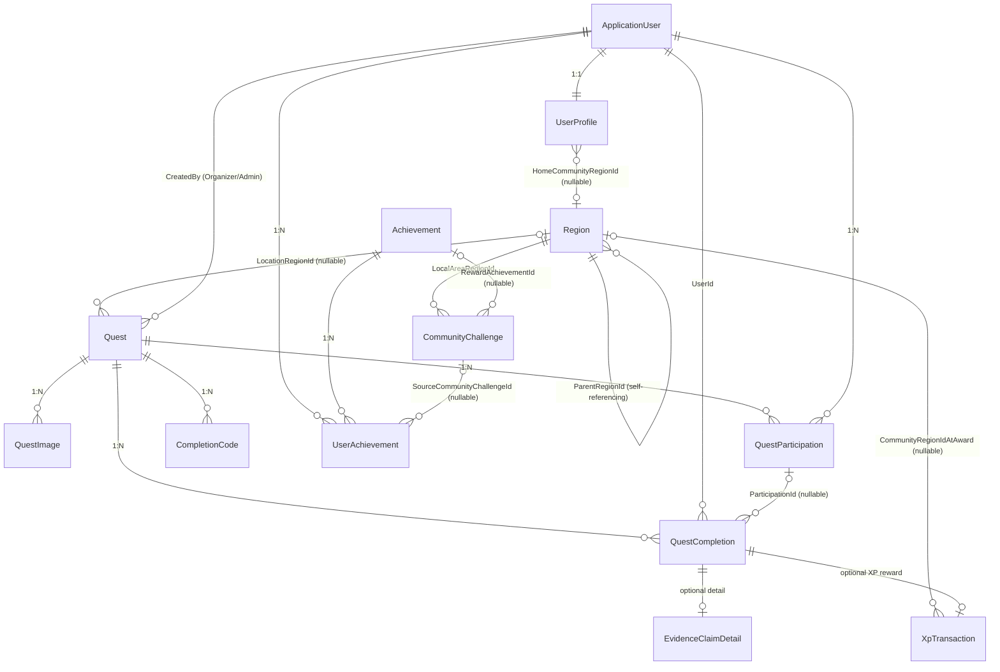

# Core Domain Data Model

- **Status:** Accepted
- **Date:** 2026-07-21
- **Purpose:** Define the complete Kiwimpact core domain data model including entities, relationships, constraints, indexes, and ownership boundaries for MVP implementation.
- **Scope:** All MVP entities and their database-level constraints. Does not define DTOs, API contracts, or UI components.

> This document records accepted data model direction. It does not claim that migrations, EF Core configuration, or seed data have been implemented. The canonical schema history lives in EF Core migration files in `Kiwimpact.Infrastructure`.

## 1. Terminology

| Term | Definition |
|------|-----------|
| Quest | An environmental activity that Members can discover, join, and complete |
| QuestCompletion | The canonical record that a Member completed a Quest, via any Method |
| CompletionCode | A reusable code issued by an Organizer that eligible Members redeem to create a verified QuestCompletion |
| EvidenceClaimDetail | Structured evidence submitted by a Member claiming completion of an external Quest; 1:1 with QuestCompletion when Method=EvidenceClaim |
| XpTransaction | An immutable ledger entry recording XP awarded for one verified QuestCompletion |
| CommunityChallenge | A time-bound monthly challenge for a LocalArea, tracking collective verified completion count |
| Home Community | The coarse-grained LocalArea a Member optionally selects for community identity and leaderboard scoping |
| Passport | The Member's personal record containing Completion History and Community Participation |

## 2. Entity-Relationship Diagram (Mermaid)



## 3. Entity and Field Tables

### 3.1 ApplicationUser (ASP.NET Core Identity)

Managed by ASP.NET Core Identity. Not defined here in detail. Key relationships:

- 1:1 with `UserProfile` via `Id`
- 1:N with `Quest` (as Organizer/Admin creator)
- 1:N with `QuestParticipation`
- 1:N with `QuestCompletion` (as completer)
- 1:N with `UserAchievement`

### 3.2 UserProfile

| Column | Type | Constraints |
|--------|------|-------------|
| `Id` | `uuid` | PK, FK → `AspNetUsers.Id` |
| `DisplayName` | `text` (max 100) | Not null |
| `HomeCommunityRegionId` | `uuid?` | Nullable. FK → `Region.Id`. Restrict delete. |
| `ShowCommunityOnPassport` | `bool` | Not null, default `false` |
| `LastCommunityChangeAt` | `timestamp with time zone?` | Nullable. Set when Home Community is changed (not first selection). Used for cooldown enforcement. |
| `TotalXp` | `bigint` | Not null, default `0`, CHECK `>= 0`. Transactional projection of the XP ledger; written only inside award transactions as a checked addition (overflow is an invariant failure that rolls back the award); never wrapped or clamped. |
| `Level` | `int` | Not null, default `1`, CHECK `BETWEEN 1 AND 99`. Always recomputed from `TotalXp` via the accepted progression formula, never incremented. Rank Title is derived from `Level` at read time and never persisted. |
| `CreatedAt` | `timestamp with time zone` | Not null |
| `UpdatedAt` | `timestamp with time zone` | Not null |

### 3.3 Region

See `specs/architecture/01-domain-model-region.md` for full specification.

| Column | Type | Constraints |
|--------|------|-------------|
| `Id` | `uuid` | PK, not null |
| `Name` | `text` (max 200) | Not null |
| `Type` | `text` (max 50) | Not null. Stores `RegionType` enum as string. |
| `ParentRegionId` | `uuid?` | Nullable. FK → `Region.Id`. Restrict delete. |
| `IsActive` | `bool` | Not null, default `true` |
| `CreatedAt` | `timestamp with time zone` | Not null |
| `UpdatedAt` | `timestamp with time zone` | Not null |

**RegionType enum:** `Country`, `AdministrativeArea`, `LocalArea`

### 3.4 Quest

| Column | Type | Constraints |
|--------|------|-------------|
| `Id` | `uuid` | PK, not null |
| `Title` | `text` (max 200) | Not null |
| `Description` | `text` (max 2000) | Not null |
| `Category` | `text` (max 50) | Not null. Stores `QuestCategory` enum as string. |
| `Status` | `text` (max 50) | Not null. Stores `QuestStatus` enum as string. |
| `SourceType` | `text` (max 50) | Not null. Stores `QuestSourceType` enum as string. |
| `RegistrationMode` | `text` (max 50) | Nullable for External source. Stores `RegistrationMode` enum as string. |
| `Difficulty` | `text` (max 50) | Not null. Stores `QuestDifficulty` enum as string. |
| `XpAward` | `int` | Not null, ≥ 0. Retained but **not a reward input**: reward amounts derive only from the immutable `QuestCompletion.RewardDifficultySnapshot`. Column retained pending a separate cleanup decision. |
| `Capacity` | `int?` | Nullable. Null = unlimited. |
| `StartAtUtc` | `timestamp with time zone?` | Nullable |
| `EndAtUtc` | `timestamp with time zone?` | Nullable |
| `LocationRegionId` | `uuid?` | Nullable. FK → `Region.Id`. Restrict delete. |
| `LocationDescription` | `text` (max 500) | Nullable |
| `ExternalSourceUrl` | `text` (max 2000) | Nullable. HTTPS only. |
| `ExternalSourceStatus` | `text` (max 50) | Nullable for non-External source. Stores `ExternalSourceStatus` enum. |
| `SourceCheckedAt` | `timestamp with time zone?` | Nullable |
| `NextCheckDueAt` | `timestamp with time zone?` | Nullable |
| `CreatedByUserId` | `uuid` | Not null. FK → `AspNetUsers.Id`. |
| `CreatedAt` | `timestamp with time zone` | Not null |
| `UpdatedAt` | `timestamp with time zone` | Not null |

**QuestCategory enum:** `RestoreNature`, `ProtectWildlife`, `CleanReduceWaste`, `GrowCompost`, `ObserveMeasure`, `LearnShare`

**QuestStatus enum:** `Draft`, `Published`, `Cancelled`, `Archived`

**Archive preconditions:** A Quest may be archived only when `Status = Cancelled` or `Status = Published` with `EndAtUtc` in the past. Draft quests cannot be archived (they should be published first or deleted).

**QuestSourceType enum:** `OrganizerOwned`, `AdminCuratedExternal`, `PlatformEcoChallenge`

**RegistrationMode enum:** `Native`, `External`, `NoneRequired`

**QuestDifficulty enum:** `Easy`, `Medium`, `Hard`

**ExternalSourceStatus enum:** `Current`, `NeedsReview`, `Changed`, `SourceRemoved`

### 3.5 QuestImage

| Column | Type | Constraints |
|--------|------|-------------|
| `Id` | `uuid` | PK, not null |
| `QuestId` | `uuid` | Not null. FK → `Quest.Id`. Cascade delete. |
| `ImageUrl` | `text` (max 2000) | Not null. URL or asset reference. |
| `AltText` | `text` (max 300) | Not null |
| `SortOrder` | `int` | Not null, default `0` |
| `IsCover` | `bool` | Not null, default `false` |
| `CreatorName` | `text` (max 200) | Nullable. Attribution. |
| `SourceUrl` | `text` (max 2000) | Nullable. HTTPS only. Original image source. |
| `LicenceNote` | `text` (max 500) | Nullable. Licence or attribution note. |

**Business rules:**
- Each Quest must have at least one QuestImage (`IsCover = true`).
- QuestImage is separate from completion evidence.
- Image ownership: Organizer manages images for owned quests; Admin manages all.

### 3.6 QuestParticipation

| Column | Type | Constraints |
|--------|------|-------------|
| `Id` | `uuid` | PK, not null |
| `UserId` | `uuid` | Not null. FK → `AspNetUsers.Id`. |
| `QuestId` | `uuid` | Not null. FK → `Quest.Id`. |
| `JoinedAt` | `timestamp with time zone` | Not null |
| `CancelledAt` | `timestamp with time zone?` | Nullable |

**Business rules:**
- Required for Native registration Quests. Capacity enforcement applies only to Native registration.
- Optional for External Quests (created when Member selects "Track in My Quests").
- Not used for `NoneRequired` Quests.
- Unique constraint on `(UserId, QuestId)` where `CancelledAt IS NULL` (one active participation per user per quest).
- For Native Quests, Completion Code redemption and Evidence Claim submission require an existing Participation.
- For External and NoneRequired Quests, completion may exist without Participation. External tracking does not consume platform Capacity.
- Native Completion Code redemption requires an active Participation; otherwise return `409`.
- Native Evidence Claim submission requires an active Participation; otherwise return `409`.
- External and NoneRequired completion paths may omit Participation.
- Self-reported completion creates no XP and does not reserve Capacity.

### 3.7 QuestCompletion (Canonical Completion Entity)

| Column | Type | Constraints |
|--------|------|-------------|
| `Id` | `uuid` | PK, not null |
| `UserId` | `uuid` | Not null. FK → `AspNetUsers.Id`. |
| `QuestId` | `uuid` | Not null. FK → `Quest.Id`. |
| `ParticipationId` | `uuid?` | Nullable. FK → `QuestParticipation.Id`. Set when completion is linked to a participation. |
| `Method` | `text` (max 50) | Not null. Stores `CompletionMethod` enum as string. |
| `Status` | `text` (max 50) | Not null. Stores `CompletionStatus` enum as string. |
| `CompletedAt` | `timestamp with time zone` | Not null. The date the Member claims/records completion. |
| `CreatedAt` | `timestamp with time zone` | Not null |
| `UpdatedAt` | `timestamp with time zone` | Not null |

**CompletionMethod enum:** `CompletionCode`, `EvidenceClaim`, `SelfReported`

**CompletionStatus enum:** `Pending`, `Verified`, `Rejected`, `SelfReported`

**Business rules:**
- `UserId` and `QuestId` are direct FKs — completion does not require a Participation row for External and NoneRequired Quests.
- `ParticipationId` is nullable. For External and NoneRequired Quests, Evidence Claims and Self Reports may exist without participation. For Native Quests, Completion Code redemption and Evidence Claim submission require an existing Participation.
- Partial unique index: `(UserId, QuestId) WHERE Status = 'Verified'` — enforces at most one Verified completion per Member per Quest in the MVP.
- Repeatable Quest completion is deferred. Future implementation must introduce `QuestOccurrence`.
- At most one Pending Evidence Claim per `(UserId, QuestId)`. Enforced by partial unique index: `(UserId, QuestId) WHERE Method = 'EvidenceClaim' AND Status = 'Pending'`.
- At most one SelfReported completion per `(UserId, QuestId)`. Enforced by partial unique index: `(UserId, QuestId) WHERE Method = 'SelfReported' AND Status = 'SelfReported'`.
- SelfReported and verification records may coexist as separate rows. A SelfReported record is never promoted or deleted when a later verification occurs.
- Passport deduplication is a read-model rule and does not delete or merge canonical completion records. Precedence: Verified > Pending EvidenceClaim > SelfReported > latest Rejected EvidenceClaim.
- Self-reported completions have `Status = SelfReported`, award no XP, and do not count toward streaks, achievements, or leaderboards.
- Use `QuestCompletion.CreatedAt` as submission time.

### 3.8 EvidenceClaimDetail

| Column | Type | Constraints |
|--------|------|-------------|
| `Id` | `uuid` | PK, not null |
| `QuestCompletionId` | `uuid` | Not null. FK → `QuestCompletion.Id`. Unique (1:1). Cascade delete. |
| `Description` | `text` (max 500) | Not null on submission (API validation). Nullable after purge. Member's description of participation. |
| `EvidenceUrl` | `text` (max 2000) | Nullable. HTTPS only. Owner/Admin only. Never public. Cleared on purge. |
| `UserDeclaration` | `bool` | Not null. Member confirms accuracy of claim. |
| `ReviewNote` | `text` (max 500) | Nullable. Admin review note. Cleared on purge. |
| `ReviewedByUserId` | `uuid?` | Nullable. FK → `AspNetUsers.Id`. |
| `ReviewedAt` | `timestamp with time zone?` | Nullable |
| `EvidencePurgeDueAt` | `timestamp with time zone?` | Nullable. Set = `ReviewedAt + 90 days` after approval or rejection. |
| `EvidencePurgedAt` | `timestamp with time zone?` | Nullable. Set when sensitive fields are cleared. |

**Business rules:**
- Only exists when `QuestCompletion.Method = EvidenceClaim`.
- Evidence URL: HTTPS only, owner/Admin only, never public, backend never downloads/previews/fetches.
- Full URL is not logged.
- Pending claims can be edited or withdrawn by the claimant. Withdrawal permanently deletes the `QuestCompletion` and its `EvidenceClaimDetail` (cascade). Evidence is removed immediately. Do not add a `Withdrawn` CompletionStatus.
- Reviewed claims cannot be edited or withdrawn by the claimant.
- Evidence purge: `EvidencePurgeDueAt = ReviewedAt + 90 days` after either approval or rejection. Background job clears `Description`, `EvidenceUrl`, and `ReviewNote` (sets to null) within 24 hours after due date.
- Retained after purge:
  - `QuestCompletion.Id`
  - `QuestCompletion.UserId`
  - `QuestCompletion.QuestId`
  - `QuestCompletion.Method`
  - `QuestCompletion.Status`
  - `QuestCompletion.CreatedAt` (submission time)
  - `EvidenceClaimDetail.ReviewedAt`
  - `EvidenceClaimDetail.ReviewedByUserId`
  - `EvidenceClaimDetail.UserDeclaration`
  - `EvidenceClaimDetail.EvidencePurgedAt`
- The XP relation remains derivable through `XpTransaction.SourceCompletionId`.
- Pending claim withdrawal remains permanent deletion of the pending `QuestCompletion` and owned `EvidenceClaimDetail`.
- Do not introduce `SubmittedAt`, `VerificationLevel`, or `EvidenceClaimDetail.XpTransactionId`.

### 3.9 CompletionCode

| Column | Type | Constraints |
|--------|------|-------------|
| `Id` | `uuid` | PK, not null |
| `QuestId` | `uuid` | Not null. FK → `Quest.Id`. |
| `CodeHash` | `text` (max 256) | Not null. Hashed code value (never store plaintext). |
| `ValidFrom` | `timestamp with time zone` | Not null |
| `ValidTo` | `timestamp with time zone` | Not null |
| `IsActive` | `bool` | Not null, default `true` |
| `IsRevoked` | `bool` | Not null, default `false` |
| `CreatedByUserId` | `uuid` | Not null. FK → `AspNetUsers.Id`. |
| `CreatedAt` | `timestamp with time zone` | Not null |

**Business rules:**
- A CompletionCode is reusable by multiple eligible Members.
- Store only a hash of the code; never store plaintext.
- Each successful redemption creates a new `QuestCompletion` with `Method = CompletionCode` and `Status = Verified`.
- The code itself carries no per-user redemption flag. Redemption eligibility is enforced by the application layer checking the unique partial index on `QuestCompletion(UserId, QuestId) WHERE Status = 'Verified'`.
- Organizer owns completion codes for their quests; Admin manages all.

### 3.10 XpTransaction

| Column | Type | Constraints |
|--------|------|-------------|
| `Id` | `uuid` | PK, not null |
| `UserId` | `uuid` | Not null. FK → `AspNetUsers.Id`. |
| `QuestId` | `uuid` | Not null. FK → `Quest.Id`. |
| `SourceCompletionId` | `uuid` | Not null. FK → `QuestCompletion.Id`. **Unique** — one XP transaction per completion (reward-idempotency boundary). |
| `XpAmount` | `int` | Not null, > 0 |
| `CommunityRegionIdAtAward` | `uuid?` | Nullable. FK → `Region.Id`. Restrict delete. Copied from the source completion's immutable `CommunityRegionIdAtCompletion`; for awards created together with the completion this equals the Home Community at award time. |
| `CreatedAt` | `timestamp with time zone` | Not null. Award-effective time: `= SourceCompletion.VerifiedAtUtc`. Reconciliation processing time is never used, and a timestamp is never invented for a completion whose `VerifiedAtUtc` is null. |

**Business rules:**
- Created only for verified QuestCompletions (`Status = Verified`, not SelfReported).
- `SourceCompletionId` is unique — one QuestCompletion yields at most one XpTransaction.
- Together with `QuestCompletion(UserId, QuestId) WHERE Status = 'Verified'` unique partial index, this forms the full reward-idempotency boundary.
- `CommunityRegionIdAtAward` is copied from the source completion's immutable `CommunityRegionIdAtCompletion` (for awards created together with the completion this equals the Home Community at award time). Must not be recalculated or updated when the user later changes community. Reconciliation never reads the current Home Community.
- Self-reported completions create no XpTransaction.
- XP amount is server-calculated from Quest difficulty; frontend never submits a trusted XP value.

### 3.11 Achievement

| Column | Type | Constraints |
|--------|------|-------------|
| `Id` | `uuid` | PK, not null |
| `Code` | `text` (max 100) | Not null, unique. Machine-readable identifier. |
| `Name` | `text` (max 200) | Not null |
| `Description` | `text` (max 500) | Not null |
| `IconUrl` | `text` (max 2000) | Nullable |
| `Category` | `text` (max 50) | Not null. e.g. `Milestone`, `Streak`, `Community`, `Category`. |
| `IsActive` | `bool` | Not null, default `true` |
| `CreatedAt` | `timestamp with time zone` | Not null |

**Business rules:**
- Achievement catalog content was originally deferred with a stable schema.
  Slice 6A (2026-07-26) implemented the first three rows — the P0 cumulative
  verified-rewarded-completion milestones, all `Category = 'Milestone'`,
  `IconUrl = NULL`, with deterministic seed GUIDs and thresholds defined in
  code (`AchievementCatalog`):

| Code | Name | Threshold (committed `XpTransaction` count) |
|------|------|----------------------------------------------|
| `verified-completions-1` | First Steps | 1 |
| `verified-completions-3` | Building Momentum | 3 |
| `verified-completions-5` | Committed Contributor | 5 |

- Catalog rows are written only by the every-environment, concurrency-safe
  `AchievementSeed` (deterministic display-field upsert) and validated
  fail-closed at application startup. Richer catalog content (6–8
  achievements incl. other categories) remains deferred future direction.

### 3.12 UserAchievement

| Column | Type | Constraints |
|--------|------|-------------|
| `Id` | `uuid` | PK, not null |
| `UserId` | `uuid` | Not null. FK → `AspNetUsers.Id`. |
| `AchievementId` | `uuid` | Not null. FK → `Achievement.Id`. |
| `SourceCommunityChallengeId` | `uuid?` | Nullable. FK → `CommunityChallenge.Id`. Set when the achievement is awarded as a Community Challenge reward. |
| `AwardedAt` | `timestamp with time zone` | Not null |
| `XpTransactionId` | `uuid?` | Nullable. FK → `XpTransaction.Id`. The XP transaction that triggered the achievement, if applicable. |

**Business rules:**
- Partial unique index on `(UserId, AchievementId)` WHERE `SourceCommunityChallengeId IS NULL` — a Member earns each non-challenge achievement at most once.
- Partial unique index on `(UserId, AchievementId, SourceCommunityChallengeId)` WHERE `SourceCommunityChallengeId IS NOT NULL` — a Member earns each challenge-reward achievement at most once per challenge.
- `SourceCommunityChallengeId` is non-null when the achievement is awarded as a Community Challenge reward; null for all other achievement awards (milestones, streaks, category achievements).

**Staged implementation (Slice 6A, 2026-07-26):** Community Challenge is
Deferred and its table does not exist. The physical `UserAchievements` table
implemented by Slice 6A deliberately **omits `SourceCommunityChallengeId`**;
the accepted first partial unique index is staged as a plain unique index
`UX_UserAchievements_UserId_AchievementId` on `(UserId, AchievementId)`,
which is semantically identical while no challenge rows can exist. The
nullable column, its `CommunityChallenge` FK, and the second partial unique
index arrive with the future Community Challenge slice as an additive
migration. All other columns match this accepted model; every Slice 6A award
sets `XpTransactionId` non-null to the resolved triggering ledger row and
`AwardedAt` to that row's `CreatedAt` (immutable once persisted).

### 3.13 CommunityChallenge

| Column | Type | Constraints |
|--------|------|-------------|
| `Id` | `uuid` | PK, not null |
| `LocalAreaRegionId` | `uuid` | Not null. FK → `Region.Id`. Must reference a Region of type `LocalArea`. Restrict delete. |
| `PeriodStart` | `timestamp with time zone` | Not null. Start of monthly challenge period. |
| `PeriodEnd` | `timestamp with time zone` | Not null. End of monthly challenge period. |
| `TargetType` | `text` (max 50) | Not null. MVP: `VerifiedCompletionCount` only. |
| `TargetValue` | `int` | Not null, > 0. Target number of verified completions. |
| `RewardAchievementId` | `uuid?` | Nullable. FK → `Achievement.Id`. Achievement awarded to contributors when challenge succeeds. |
| `Status` | `text` (max 50) | Not null. Stores `ChallengeStatus` enum. |
| `CreatedAt` | `timestamp with time zone` | Not null |
| `UpdatedAt` | `timestamp with time zone` | Not null |

**ChallengeStatus enum:** `Active`, `Completed`, `Failed`, `Cancelled`

**Business rules:**
- At most one Active challenge per LocalArea at any time.
- Challenge finalization is performed by a lightweight .NET hosted background service (`BackgroundService` implementation) that periodically evaluates Active challenges whose `PeriodEnd` has passed. Target met → `Completed`; target not met → `Failed`. Reward awards are performed idempotently.
- Do not introduce Hangfire or another job framework.
- Enforced via partial unique index: `(LocalAreaRegionId) WHERE Status = 'Active'`.
- Progress is derived by querying `XpTransaction` — count of verified completions where `CommunityRegionIdAtAward = LocalAreaRegionId` and `XpTransaction.CreatedAt >= PeriodStart` AND `XpTransaction.CreatedAt < PeriodEnd` (half-open interval `[PeriodStart, PeriodEnd)`).
- Do not create a `CommunityChallengeContribution` entity.
- Rewards use `RewardAchievementId` only. Do not create `RewardBadgeCode` or another badge reward system.
- Members do not manually join; contribution is automatic when eligible XP is awarded.
- Historical contribution does not move when Home Community changes.
- **Editing restrictions (MVP):** Admin may edit region, period, target, and reward only before `PeriodStart`. Once `PeriodStart` has arrived, or once any eligible contribution exists, those competitive fields are immutable. An already-started challenge may only be cancelled. Reducing the target below current progress is forbidden. Return `409 Conflict` for prohibited changes.

## 4. Enums Summary

```text
RegionType:            Country, AdministrativeArea, LocalArea
QuestCategory:         RestoreNature, ProtectWildlife, CleanReduceWaste, GrowCompost, ObserveMeasure, LearnShare
QuestStatus:           Draft, Published, Cancelled, Archived
QuestSourceType:       OrganizerOwned, AdminCuratedExternal, PlatformEcoChallenge
RegistrationMode:      Native, External, NoneRequired
QuestDifficulty:       Easy, Medium, Hard
ExternalSourceStatus:  Current, NeedsReview, Changed, SourceRemoved
CompletionMethod:      CompletionCode, EvidenceClaim, SelfReported
CompletionStatus:      Pending, Verified, Rejected, SelfReported
ChallengeStatus:       Active, Completed, Failed, Cancelled
```

## 5. Constraints and Indexes Summary

### 5.1 Unique Constraints and Indexes

| Table | Constraint/Index | Type | Purpose |
|-------|-----------------|------|---------|
| Region | `(Name, Type, ParentRegionId)` | Unique | Prevent duplicate region names within the same parent scope. See `specs/data/01-community-identity-data-model.md` §1.2 for NULL handling. |
| Region | `(Type, IsActive)` | Index | Community selector query performance |
| Region | `ParentRegionId` | Index | Hierarchy traversal |
| QuestParticipation | `(UserId, QuestId) WHERE CancelledAt IS NULL` | Partial unique index | One active participation per user per quest |
| QuestCompletion | `(UserId, QuestId) WHERE Status = 'Verified'` | Partial unique index | At most one Verified completion per Member per Quest (MVP rule) |
| QuestCompletion | `(UserId, QuestId) WHERE Method = 'EvidenceClaim' AND Status = 'Pending'` | Partial unique index | At most one Pending Evidence Claim per Member per Quest |
| QuestCompletion | `(UserId, QuestId) WHERE Method = 'SelfReported' AND Status = 'SelfReported'` | Partial unique index | At most one SelfReported completion per Member per Quest |
| QuestCompletion | `ParticipationId` | Index | Lookup completions by participation |
| EvidenceClaimDetail | `QuestCompletionId` | Unique | 1:1 with QuestCompletion |
| CompletionCode | `(QuestId, IsActive, IsRevoked)` | Index | Lookup active codes for a quest |
| XpTransaction | `SourceCompletionId` | Unique | One XP transaction per QuestCompletion (reward idempotency) |
| XpTransaction | `(CommunityRegionIdAtAward, CreatedAt)` | Index | Community Challenge progress queries |
| XpTransaction | `(UserId, CreatedAt)` | Index | Personal XP history, leaderboard queries |
| UserAchievement | `(UserId, AchievementId) WHERE SourceCommunityChallengeId IS NULL` | Partial unique index | One award per non-challenge achievement per user |
| UserAchievement | `(UserId, AchievementId, SourceCommunityChallengeId) WHERE SourceCommunityChallengeId IS NOT NULL` | Partial unique index | One award per challenge-reward achievement per user per challenge |
| Achievement | `Code` | Unique | Machine-readable identifier |
| CommunityChallenge | `(LocalAreaRegionId) WHERE Status = 'Active'` | Partial unique index | At most one Active challenge per LocalArea |
| CommunityChallenge | `(LocalAreaRegionId, PeriodStart)` | Index | Challenge history lookup |

### 5.2 Foreign Key Delete Behaviors

| FK Relationship | Delete Behavior | Rationale |
|-----------------|----------------|-----------|
| All → `Region.Id` | `Restrict` | Historical references must not be orphaned. Deactivation via `IsActive`. |
| `QuestImage` → `Quest` | `Cascade` | Images are owned by and live/die with the Quest. |
| `EvidenceClaimDetail` → `QuestCompletion` | `Cascade` | Detail is 1:1 owned by the completion. |
| `QuestCompletion` → `QuestParticipation` | `SetNull` | Completion outlives cancelled participation. |
| All other FKs | `Restrict` | Default safe behavior; specific cases reviewed during implementation. |

## 6. Ownership Boundaries

| Resource | Owner | Authorization Rule |
|----------|-------|--------------------|
| UserProfile | The Member (self) | Self only. Admin may access specific UserProfile fields (e.g., display name) when needed for authorised operational purposes (e.g., claim review includes claimant display name), but there is no general Admin UserProfile-read endpoint. |
| Quest | Organizer (creator) or Admin | Organizer manages owned quests; Admin manages all |
| QuestImage | Organizer (quest owner) or Admin | Same as parent Quest |
| QuestParticipation | The Member (self) | Self only (join/cancel own participation) |
| QuestCompletion | The Member (self) | Self read; Admin review for EvidenceClaim; Organizer: limited operational participant list and aggregate completion summary; no evidence or private profile data. Organizer cannot receive Verified Completion for own quests (self-dealing prevention). |
| EvidenceClaimDetail | The Member (self) + Admin | Self read/write (pending only); Admin read/write (review). Admin cannot approve/reject own claim. |
| CompletionCode | Organizer (quest owner) or Admin | Organizer manages codes for owned quests; Admin manages all |
| XpTransaction | System (immutable) | Read by owning Member, Admin; never modified after creation |
| UserAchievement | The Member (self) | Self read; System awards |
| CommunityChallenge | Admin | Guest and Member: public aggregate read. Admin: create and manage. Organizer: no special management privilege beyond public/member read. Private personal contribution data remains available only to the owning Member through Passport endpoints. |
| Region | System (seed) | Public read (active only); Admin manages seed |

## 7. Transaction Boundaries

- XP award: creating a `Verified` QuestCompletion (via CompletionCode redemption or Admin claim approval) and its XpTransaction must be atomic — a single `SaveChangesAsync()` call. Slice 5A restored this atomicity for Completion Code redemption: completion, `XpTransaction`, and the profile progression projection commit or roll back in one transaction. The single bounded exception is the historical reconciliation of pre-ledger Slice 4B completions: a hosted background service awards each legacy completion in its own per-row transaction, with unique `SourceCompletionId` as the authoritative idempotency boundary and the completion's immutable `VerifiedAtUtc` as the award-effective timestamp.
- EvidenceClaim review: updating QuestCompletion.Status to `Verified` + `ReviewedAt`/`ReviewedBy` + creating XpTransaction must be atomic.
- CommunityChallenge progress is derived (read-only query); no transactional write.
- CompletionCode redemption: creating a Verified QuestCompletion + XpTransaction must check the `(UserId, QuestId) WHERE Status = 'Verified'` uniqueness constraint and the redemption eligibility in one atomic operation.
- Self-dealing prevention rules:
  - Organizer cannot redeem a CompletionCode or receive a Verified Completion for an Organizer-owned Quest they created. The application service must reject the operation (409 Conflict).
  - Admin cannot approve or reject their own Evidence Claim. An Admin claim requires review by a different Admin. The review service must reject self-review (409 Conflict).
- Organizer-owned Quest Evidence Claim submission is rejected before persistence with `409 Conflict`. The application service must not create a `QuestCompletion` or `EvidenceClaimDetail` row for the rejected request.

## 8. Concurrency Strategy

- Default: optimistic concurrency via EF Core concurrency tokens on mutable entities.
- Entities with concurrency tokens: `Quest`, `QuestParticipation`, `QuestCompletion`, `CommunityChallenge`.
- XP award idempotency is enforced through unique constraints (database-level guard), not application-level retry logic.
- `UserProfiles.TotalXp`/`Level` progression updates are serialized by a `SELECT ... FOR UPDATE` row lock on the profile row inside award transactions; no new concurrency token is added for progression.

## 9. MVP and Deferred Scope

### MVP

All entities and fields listed in §3 are MVP scope except as noted below.

### Deferred

- Achievement catalog content beyond the three Slice 6A P0 milestones (see
  §3.11) — schema stable, richer content deferred
- Repeatable Quest completion (`QuestOccurrence`)
- Virtual currency, Wallet, Shop, purchasing
- Community Challenge seasons, leagues, editable scoring formulas
- Image evidence upload (MVP uses URL only)
- Public Profile, social features, notifications

## 10. Implementation Invariants

1. Only approved Infrastructure persistence components may access `DbContext` directly.
2. EF Core migrations are the canonical schema history.
3. Applied/shared migrations are immutable. Use corrective migrations.
4. Region seed data is managed through `RegionSeed` class, not migrations.
5. Seed data must be idempotent.
6. Timestamps are stored as UTC using `timestamp with time zone`.
7. `Pacific/Auckland` is used for display and business-week calculations. Calendar boundaries are calculated in `Pacific/Auckland`, then converted to UTC for persistence and querying.
8. XP amount is server-calculated; frontend never submits a trusted XP value.
9. XP is never awarded for SelfReported completions.
10. `CommunityRegionIdAtAward` is immutable after creation.

## 11. Resolved Completion-Lifecycle Decisions

The following Completion lifecycle decisions are approved for the MVP.
DeepSeek and other implementation agents must implement these rules exactly
and must not select alternative behavior without new human approval.

### 11.1 One Pending Evidence Claim per Member and Quest

- A Member may have at most one `Pending` Evidence Claim for the same Quest.
- Enforce this with a partial unique index on `(UserId, QuestId)` where
  `Method = 'EvidenceClaim' AND Status = 'Pending'`.
- A second claim submission while a Pending claim exists returns
  `409 Conflict`.
- The Member edits the existing Pending claim through the existing update
  endpoint.
- Withdrawing the Pending claim permanently deletes it and releases the unique
  slot.
- After a claim is Rejected, the Member may submit a new Evidence Claim.
- Multiple historical Rejected claims are permitted.

### 11.2 One SelfReported Completion per Member and Quest

- A Member may have at most one SelfReported completion for the same Quest.
- Enforce this with a partial unique index on `(UserId, QuestId)` where
  `Method = 'SelfReported' AND Status = 'SelfReported'`.
- A second SelfReported submission for the same Quest returns `409 Conflict`.
- Repeatable Quest completion remains deferred until `QuestOccurrence` is
  introduced.

### 11.3 SelfReported and Later Verification

- A SelfReported completion may coexist with a Pending, Rejected, or Verified
  verification record for the same Member and Quest.
- A SelfReported record is not promoted, mutated, or deleted when a Member
  later submits an Evidence Claim or redeems a Completion Code.
- A later Verified completion remains a separate `QuestCompletion` and is the
  only record that may create an `XpTransaction`.
- Passport completion history displays one primary record per Quest using this
  precedence:
  1. Verified;
  2. Pending EvidenceClaim;
  3. SelfReported;
  4. latest Rejected EvidenceClaim.
- Where more than one Rejected Evidence Claim exists, use the record with the
  latest `CreatedAt`.
- Full Evidence Claim history remains available through the claim-history
  endpoints and is not removed by Passport deduplication.

### 11.4 Organizer-Owned Quest Evidence Claim

- An Organizer who created an Organizer-owned Quest may not submit an Evidence
  Claim for that Quest.
- Reject the submission at
  `POST /api/v1/quests/{questId}/claims` with `409 Conflict`.
- Do not persist a Pending `QuestCompletion` or `EvidenceClaimDetail` for the
  rejected request.
- This is the earliest enforcement point for the existing rule that an
  Organizer cannot receive a Verified Completion or XP from their own Quest.
- This restriction does not prevent the Organizer from completing Quests
  created by another Organizer or Admin.

## 12. Verification Checklist

- [ ] All entities have EF Core configurations matching these field definitions
- [ ] All unique constraints and indexes are created in migrations
- [ ] Partial unique indexes use correct `WHERE` clauses
- [ ] Region FKs use `Restrict` delete behavior
- [ ] QuestImage → Quest uses `Cascade` delete
- [ ] EvidenceClaimDetail → QuestCompletion uses `Cascade` delete
- [ ] XP award is atomic (completion + transaction in one SaveChangesAsync)
- [ ] Concurrency tokens are configured on mutable entities
- [ ] Seed data is idempotent and in seed classes, not migrations
- [ ] SelfReported completions create no XpTransaction
- [ ] `CommunityRegionIdAtAward` snapshot is immutable
- [ ] CommunityChallenge progress is derived, not stored in a contribution table
- [ ] `LastCommunityChangeAt` column exists in UserProfile table
- [ ] Partial unique index prevents duplicate Pending Evidence Claims
- [ ] Partial unique index prevents duplicate SelfReported completions
- [ ] SelfReported and Verified records may coexist without duplicate XP
- [ ] Passport displays one primary completion per Quest using the accepted precedence
- [ ] Organizer-owned Quest Evidence Claim submission is rejected before persistence

## 13. Related Documents

- `specs/architecture/01-domain-model-region.md` — Region entity full specification
- `specs/data/01-community-identity-data-model.md` — Community identity data model
- `specs/product/01-product-requirements.md` — Product requirements
- `specs/product/02-community-identity-and-gamification-scope-update.md` — Community identity and gamification scope
- `specs/product/03-community-challenge-scope.md` — Community Challenge scope
- `specs/architecture/03-api-contract.md` — API contract
- `specs/Kiwimpact_Final_Planning_Baseline_v1.0.md` — Planning baseline
- ADR-0001: PostgreSQL
- ADR-0008: Community Identity, Local Leaderboards, and Virtual Economy Scope
- `.clinerules/03-database.md` — Database rules
- `.clinerules/01-architecture.md` — Architecture constraints