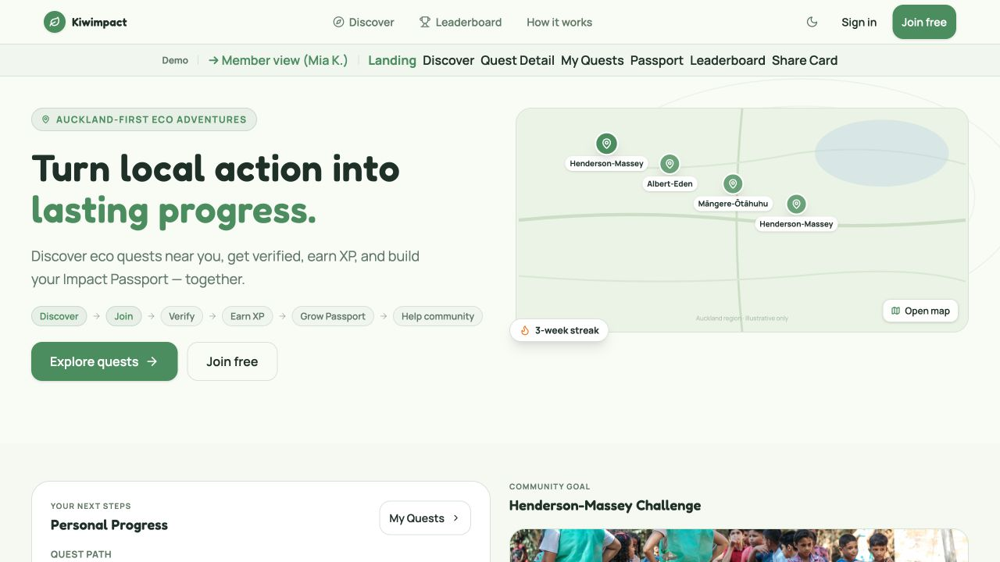
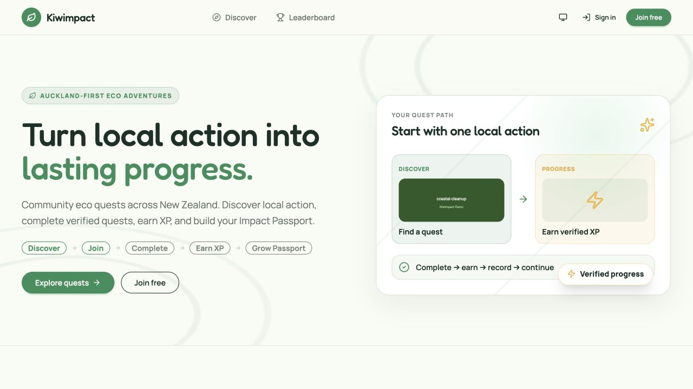
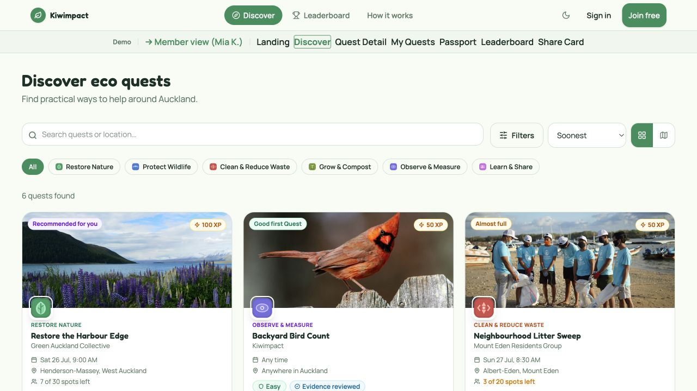
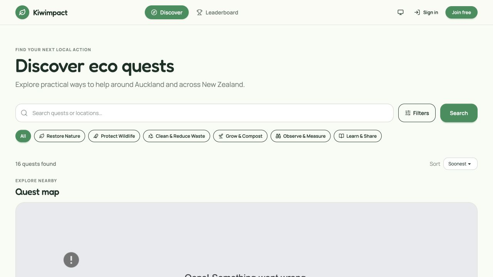
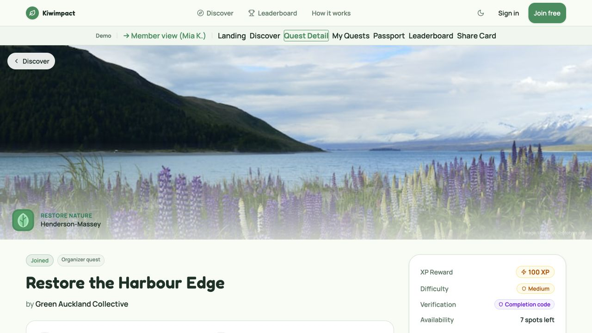
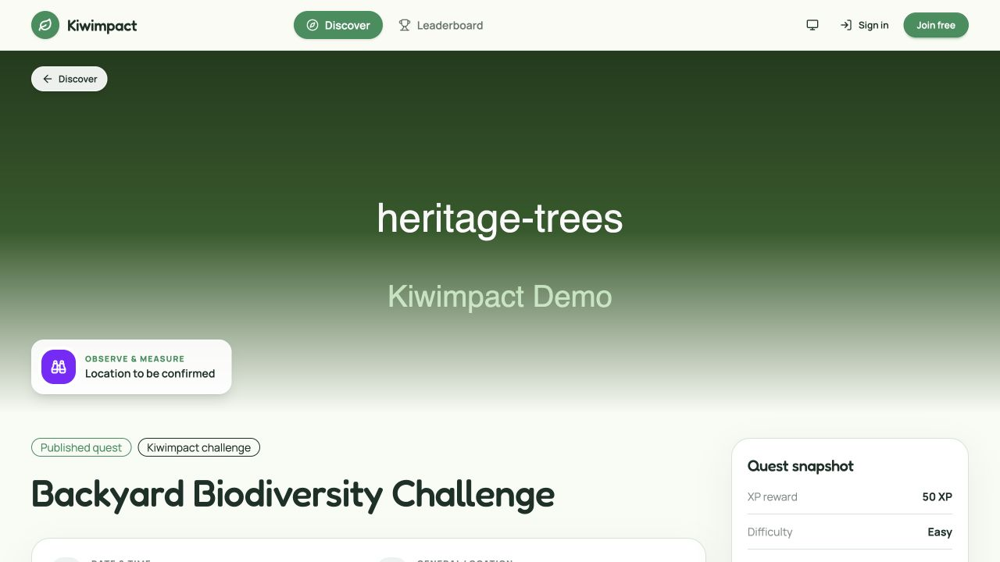
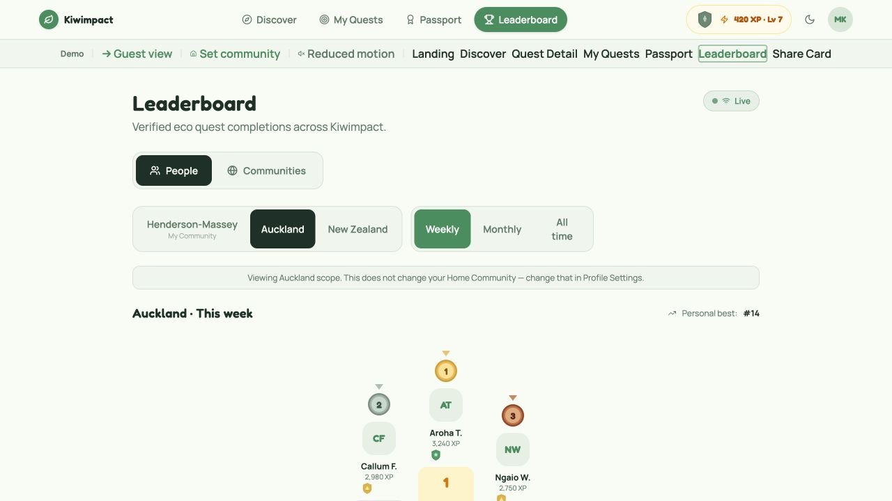
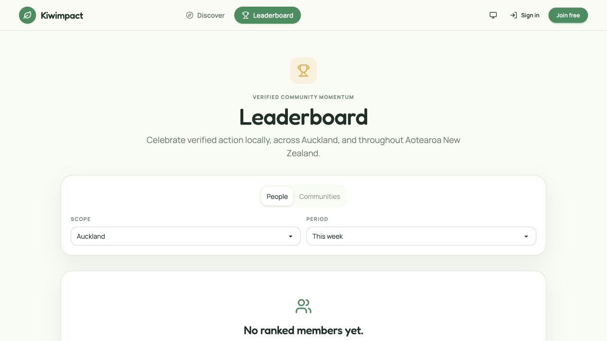

# Slice 14 — Figma Parity Audit Report

## Executive conclusion

The observation is correct: the current product has **substantial functional
coverage but only partial design parity** with the Figma Make MVP.

The main problem is not one isolated CSS defect. Slices 9 and 12 translated
the prototype into the existing production component system and truthful API
states, but they did not use page-by-page visual fidelity as the acceptance
gate. The result shares the palette, typefaces, rounded cards, navigation
destinations, and much of the product behaviour, while materially changing:

- section order and top-of-fold composition;
- information density and column proportions;
- Discover list/map behaviour;
- the gameful identity expressed by category emblems, rank crests, achievement
  art, medals, progress surfaces, and challenge art;
- Member dashboard and Passport composition;
- populated Leaderboard treatment;
- mobile-specific composition;
- several interaction layers and data-rich preview states.

This is why the product can truthfully be described as “implemented” while
still looking much simpler than the approved design.

The next Slice should be a **faithful presentation restoration Slice**, not
another feature-convergence Slice. It should preserve real APIs and accepted
privacy/security rules, but rebuild the seven Make page compositions and their
shared visual components against stored screenshot acceptance evidence.

## Audit basis

### Sources inspected

- Runnable local Make export:
  `docs/UI/Kiwimpact MVP UI Design/`
- Accepted UX generation specification:
  `specs/ux/02-figma-ai-mvp-ui-generation-spec.md`
- Accepted Slice 9 contract and completion/review records
- Accepted Slice 11, 11A, and 12 contracts and completion/review records
- Current frontend routes, pages, shared components, presentation mappings,
  tests, and CSS
- Current backend/API contracts where a visual element depends on real data

### Browser observations

The Make export and current product were run independently and inspected at
1280 × 720. Full-page and viewport captures are stored in the evidence
directory.

Representative comparisons:

| Page | Make reference | Current product |
|---|---|---|
| Landing |  |  |
| Discover |  |  |
| Quest Detail |  |  |
| Leaderboard |  |  |

Current Member pages could not be browser-inspected with representative
authenticated data in this read-only audit. Their production source and
existing tests were compared with the runnable Member prototype. This
limitation is material because Slice 12 also recorded that authenticated
browser verification had not been completed.

## Overall parity assessment

| Area | Functional status | Design parity | Finding |
|---|---|---:|---|
| Theme tokens | Implemented | High | Core colours and light/dark variables closely match Make. |
| Typography | Implemented | Medium-high | Manrope/Fredoka are present, but scale, weight, and density differ page by page. |
| Global shell | Implemented | Medium | Destinations and responsive bottom nav exist; member identity/art and detailed spacing differ. |
| Landing | Mostly implemented | Low-medium | Hero language is close, but the primary visual, lower section order, community surface, and Passport showcase diverge. |
| Discover | Implemented | Low | Search/filter/cards exist, but default map placement, controls, category art, and above-fold quest density do not match. |
| Quest Detail | Mostly implemented | Low-medium | Core facts/actions exist; content hierarchy, art, gallery, map, related quests, and mobile CTA differ or are absent. |
| My Quests | State logic implemented | Low | Production behaves mainly as a classified quest list; Make is a complete member dashboard/Mission Board. |
| Completion flow | Implemented | Medium | Code, claim, self-report, and reward logic exist; method selection and celebration composition are not fully faithful. |
| Passport | Broadly implemented | Low-medium | Real summary, achievements, categories, communities, claims, history, and share entry exist; distinctive composition and art are missing. |
| Leaderboard | Implemented | Low-medium | Scopes/periods/modes exist; populated podium, crests, medals, current-user context, and visible live state differ. |
| Share Card | Implemented | Medium | Control/preview architecture is close; themes, imagery, card art, and authenticated visual acceptance are incomplete. |
| Mobile | Responsive classes exist | Unverified | No live 390 px parity evidence exists; previous work also deferred the real narrow-viewport pass. |

## Why the gap happened

### 1. The acceptance target was “visual language,” not faithful page parity

Slice 9's stated goal was to bring the product into the prototype's “cohesive
visual language.” It explicitly treated Make as a visual and interaction
reference rather than code to merge. Its completion report also states that
pixel-level inspection was neither available nor required.

That was a valid implementation boundary, but it is weaker than the product
owner's current expectation. Matching colours, fonts, rounded surfaces, and
general hierarchy is not the same as reproducing the page composition.

### 2. One Slice combined too many concerns

Slice 9 combined:

- a design-token rebuild;
- all public pages;
- shell and responsive navigation;
- a new authenticated API;
- My Quests;
- completion and reward UI;
- Passport and Leaderboard;
- auth, organizer, error, and state redesigns;
- full frontend/backend verification.

This breadth rewarded reusable generic styling and functional safety. It did
not leave a separate acceptance loop for each reference page.

### 3. The implementation reused a small generic surface vocabulary

The current design system is dominated by:

- `kiwi-page`;
- `kiwi-panel`;
- daisyUI buttons, tabs, badges, alerts, inputs, and dialogs;
- Lucide icons;
- one generic topographic background.

The Make prototype instead builds product identity with bespoke components:

- six illustrated category emblems;
- four rank crests;
- achievement badge artwork;
- first/second/third-place medal artwork;
- level and challenge detail modals;
- dense player status surfaces;
- quest gallery treatment;
- custom source, verification, status, and progress chips.

Production has functional equivalents for some of these, but the visual
equivalents were simplified to a generic icon in a rounded box. That single
choice explains a large part of the “too simple” impression.

### 4. No stored side-by-side screenshot gate existed

Slice 9's browser pass inspected the production application, found a real XP
mapping defect, and verified flows. It did not record a route-by-route visual
comparison between the running Make prototype and production.

The independent K3 review explicitly did not run a browser. It reviewed
security, correctness, responsive structure, evidence, and code boundaries.
It therefore could approve a correct implementation without independently
validating visual fidelity.

### 5. Narrow-screen fidelity was repeatedly deferred

Slice 9 recorded that the browser remained at 1280 × 720 and did not expose
viewport emulation. The 320/375 px visual pass was deferred. Slice 14 observed
the same limitation. Responsive Tailwind classes and tests prove structural
intent, but they do not prove that the 390 px Make layouts were restored.

### 6. Slice 12 closed data composition, not presentation fidelity

Slice 12 correctly focused on authoritative product gaps:

- Passport summary and community participation reads;
- Share Card Builder;
- Member Home momentum;
- Mission Board state classification.

Its report explicitly records that authenticated Passport visual verification
was still required. It also rejected hard-coded category targets and the fixed
eight-badge prototype presentation because those were not accepted production
rules. The code therefore became functionally richer without receiving a full
authenticated visual acceptance pass.

### 7. Truthful production data is visually sparse compared with demo state

The Make export is a 2,493-line single-page demo with hard-coded:

- Mia K.'s progression;
- ranks and leaderboard movement;
- six populated quests;
- achievement progress;
- a 42/50 community challenge;
- completion history;
- category totals;
- gallery imagery;
- share-card choices.

Production correctly refuses to invent these values. A new or empty local
database therefore renders empty states and hides many visual components. The
project currently lacks a deterministic, representative **visual acceptance
fixture** that exercises populated states without shipping demo values to real
users.

### 8. Asset constraints were handled by simplification

Slice 9 correctly excluded remote Unsplash URLs and unlicensed/generated
dependency output. However, repository-owned replacements do not yet provide
the same photographic and illustrated quality. The Quest Detail evidence shows
that a text-heavy SVG illustration can occupy the hero as a fallback, which is
truthful and licensed but visually far from the reference.

### 9. Some reference content has no authoritative production field

Literal restoration is blocked for a small set of content:

- public organizer/display attribution;
- eligibility text;
- dedicated “what to expect” copy;
- personal-best and rank-movement history;
- exact badge progress for prototype-only achievement definitions.

Duration can be derived when start/end are present. Related quests can be
derived from existing public Quest data. The other items require either a
truthful conditional presentation, a small approved API/domain extension, or
omission. They must not be filled with prototype sample text.

## Page-by-page findings

### Landing

**Already implemented**

- guest/member-aware Home route;
- hero copy, CTA, core-loop chips;
- real featured Quest catalogue;
- six-step explanation;
- Passport/value proposition;
- authenticated progression, streak, community, participation, and challenge
  queries.

**Material differences**

- Make's hero uses a local-map/adventure visual and streak badge; production
  uses a generic quest-path diagram.
- Make shows Personal Progress and Community Goal together immediately below
  the hero. Production separates or conditionally hides these compositions.
- The Make page has stronger section rhythm, richer Passport/badge showcase,
  and a closing CTA/footer.
- Member and guest variants need separate screenshot acceptance; a shared
  generic hero is insufficient.

**Next Slice treatment**

Rebuild both guest and Member top-of-page compositions, retain real data, and
use truthful empty/fallback cards in the same geometry when data is absent.

### Discover

**Already implemented**

- search, category filtering, advanced filters, sorting, paging;
- Quest cards with real images/fallbacks and source/registration metadata;
- real Google Maps integration and Quest coordinates;
- list and map content.

**Material differences**

- Make defaults to a compact cards view with quests visible above the fold and
  treats map as a peer view toggle.
- Production places a large map before the complete list, so the first Quest
  cards disappear below the fold.
- Make's search, Filters, sort, cards/map toggle, and category chips form one
  compact control band.
- Production category icons are generic Lucide marks rather than the category
  emblems.
- Make cards have denser status, verification, capacity, recommendation, and
  source styling.

**Next Slice treatment**

Make Cards the default, restore Cards/Map view switching, move the real map
behind the Map view, and port the distinctive card/emblem/chip system while
retaining current filters, paging, and map behavior.

The map error in the 5174 audit screenshot is an allowed-referrer artifact.
The authorized 5173 capture confirms Google Maps loads and is not a parity
blocker.

### Quest Detail

**Already implemented**

- real Quest detail, cover/fallback, facts, reward, briefing, gallery data;
- source and registration distinctions;
- join/cancel and completion workflows;
- sticky desktop action column;
- trusted claim/self-report panels.

**Material differences**

- Make uses a photographic full-width hero with category/location identity;
  production fallback art can read as a large text poster.
- Make's summary includes organizer, duration, eligibility, capacity, reward
  progress, community contribution, and a denser sticky snapshot.
- The Make gallery is a primary carousel/thumbnail experience; production is a
  conditional grid.
- General-location map and related quests are absent from the current page.
- Mobile sticky action behavior required by the accepted UX spec is not
  visibly established in production evidence.

**Next Slice treatment**

Restore the hero geometry, content rhythm, gallery treatment, real map section,
related Quest rail, and mobile sticky action. Display missing optional facts
only when they can be derived or returned truthfully.

### My Quests / Mission Board

**Already implemented**

- complete fail-closed classification into Active, Ready to Complete, Under
  Review, Completed, and Cancelled;
- real participation, claim, and Passport reads;
- direct Quest, completion, Passport, and Share Card actions;
- progression summary and loading/error/empty states.

**Material differences**

- The Make page is a member dashboard. Its first viewport combines rank crest,
  XP progress, streak, community leaderboard position, next achievement,
  community challenge, and next completion action.
- Production begins with a generic Player Status panel and then focuses on the
  classified Quest list.
- Recent achievements, Passport preview, community/challenge surface, and
  position preview are absent or materially separated.
- Make's tab cards and action banner are more compact and information-dense.

**Next Slice treatment**

Keep the current classification logic unchanged, but rebuild the page shell
around a real-data dashboard composition. This page is the largest gap and
should not be treated as a card recolour.

### Completion and Reward

**Already implemented**

- completion code, evidence claim, and self-report flows;
- secure validation and truthful XP rules;
- responsive code dialog/sheet;
- authoritative reward overlay after verified code redemption.

**Material differences**

- Make presents a clear “How did you complete it?” method chooser before the
  method-specific form.
- Current Quest Detail exposes method panels according to supported behaviour
  rather than reproducing the chooser composition.
- Make's reward sequence includes a stronger level/rank/achievement reveal
  hierarchy and Share Card action; production correctly shows only confirmed
  reward/progression but is visually simpler.

**Next Slice treatment**

Restore the chooser and celebration composition while filtering to methods
actually allowed for the Quest and showing optional reveals only from
authoritative responses.

### Passport

**Already implemented**

- display identity, real progression, rank title, verified count, streak, Home
  Community;
- next server-backed milestone;
- category aggregates;
- achievement catalogue and earned achievements;
- historical community participation;
- claims, completion history, pagination, and Share Card entry.

**Material differences**

- Make's green summary banner, rank crest, XP bar, and compact verified/streak
  stats establish a stronger identity.
- Make uses illustrated category rows and badge collection states; production
  uses generic cards/icons.
- Make provides All/Verified/Self-reported/category history filters; production
  displays paginated history without this full filter composition.
- Production adds valid real features such as claims, privacy settings, and
  community history, but their placement weakens the Passport's visual story.
- No representative authenticated browser screenshot exists for the completed
  Slice 12 Passport.

**Next Slice treatment**

Treat Passport as a full page recomposition. Retain every real section, but
match the Make hierarchy and art. Add truthful history filters; do not recreate
fictional category targets or fixed badge counts.

### Leaderboard

**Already implemented**

- People/Communities mode;
- My Community/Auckland/New Zealand scopes where allowed;
- weekly/monthly/all-time periods;
- privacy thresholds;
- community challenges;
- SignalR invalidation.

**Material differences**

- The observed local page is an empty state, while Make demonstrates the
  intended populated hierarchy.
- Production podium cards use generic Trophy/Medal icons and omit the bespoke
  medal/rank art.
- Current-user pinned context, personal best, movement, rank crest, and visible
  Live/Reconnecting/Unavailable status do not match the reference.
- Filter controls are generic selects inside one panel rather than the Make
  segmented geography/period controls.

**Next Slice treatment**

Build populated and empty visual states. Reuse real scope/period/mode data,
restore podium/table/current-user geometry, and expose truthful connection
status. Do not invent personal-best or movement values unless the API supplies
them.

### Share Card Builder

**Already implemented**

- verified-completion selection;
- opt-in display name;
- visual theme and overlay controls;
- privacy-safe square preview;
- 1080 × 1080 PNG export;
- Web Share with download fallback.

**Material differences**

- Theme choices, source imagery, preview art, category/rank treatments, and
  control density differ from Make.
- Authenticated browser acceptance of the actual Builder remains unobserved.

**Next Slice treatment**

Keep the current privacy/export implementation and replace only the visual
composition. The canvas export and on-screen preview must share one design
model so they cannot drift.

## Three required classifications

### A. Existing functionality that primarily needs faithful presentation

- shell and member bottom navigation;
- light/dark tokens and reduced motion;
- Quest search, filters, sorting, paging, map, and cards;
- Quest facts, gallery data, participation, and completion actions;
- My Quests classification;
- progression, achievements, weekly streak, Home Community, and challenges;
- People/Communities multi-scope leaderboard;
- Passport summary, claims, history, and community participation;
- Share Card privacy, selection, export, and Web Share;
- account, organizer, and Admin routes that should retain the shared system.

### B. Accepted UI/composition that is missing or materially incomplete

- Cards/Map peer switching with Cards as the Discover default;
- gameful category emblems, rank crests, badge and medal art;
- Member Mission Board dashboard composition;
- populated Leaderboard podium/table/current-user presentation;
- visible live/reconnecting/unavailable status;
- Quest Detail location map, related quests, gallery carousel, and mobile
  sticky CTA;
- Passport history filters and faithful category/achievement presentation;
- method chooser and fuller reward celebration hierarchy;
- representative authenticated and 390 px visual acceptance evidence;
- deterministic populated-state visual fixtures.

### C. Make content that must not be copied literally

- the Demo toolbar and guest/member simulation controls;
- Mia K. or any hard-coded user;
- fixed XP, rank, leaderboard, personal-best, and movement values;
- the 42/50 challenge and other hard-coded challenge totals;
- fictional category completion targets;
- an assumed fixed eight-achievement catalogue;
- remote Unsplash URLs or unverified image licensing;
- organizer, eligibility, evidence, location, or outcome copy not present in
  authoritative data;
- a fake “Live” status when SignalR state is not connected.

## Priority and risk

### P0 — required for the next Slice to be called restored

- shared bespoke visual primitives and assets;
- shell parity;
- Landing, Discover, Quest Detail top-level geometry;
- Mission Board, Passport, Leaderboard, and Share Builder recomposition;
- completion/reward presentation;
- 1440 px and 390 px evidence for all seven pages;
- representative populated, empty, loading, error, and privacy-protected
  states;
- stored side-by-side review evidence.

### P1 — include when supported by current data

- location map and related Quest rail;
- history filter behavior;
- visible live connection state;
- exact canvas/preview Share Card parity;
- member dashboard previews and next-action prioritization.

### Product/API decisions, not safe visual assumptions

- public organizer attribution;
- eligibility and “what to expect” content fields;
- historical personal best and rank movement;
- exact achievement-progress contracts beyond the accepted catalogue.

If these are required for literal content parity, the next Slice must stop and
obtain the relevant API/domain approval. Their absence does not justify fake
copy.

## Recommended next Slice

Use the proposed
[`15-figma-faithful-ui-restoration.md`](../15-figma-faithful-ui-restoration.md)
contract. It divides one Slice into three bounded phases:

1. visual foundation, shell, and public journey;
2. authenticated member journey and completion/share surfaces;
3. Leaderboard, responsive/state closure, and evidence.

This sequence is important. Building page-specific Tailwind first would repeat
the same generic-component drift. The distinctive primitives and screenshot
acceptance harness must exist before page conversion.

## Verification performed

- Ran the local Make prototype and current frontend/API independently.
- Observed the seven Make pages and completion-method overlay.
- Observed current Landing, Discover, Quest Detail, Leaderboard, Login, and
  Register.
- Confirmed authenticated production routes redirect anonymous users to Login.
- Confirmed Google Maps loads at the authorized local origin.
- Inspected all current primary page components and shared visual primitives.
- Inspected accepted UX and Slice 9–12 contracts, completion reports, K3 review
  scope, browser limitations, and known exclusions.
- Stored viewport and full-page evidence listed in the evidence manifest.

## Known limitations

- No live 390 px comparison was possible with the available browser control.
- No representative authenticated production screenshot was created in this
  read-only audit.
- This report evaluates the runnable Make export, not Design-mode nodes or
  inspectable Figma component metadata.
- No production build/test gate was run because production code did not change.
- No independent review has been requested for this documentation-only audit.

## Final assessment

The earlier Slices are not fraudulent or functionally empty; they solved
correctness, data authority, privacy, and broad UX coverage. The failure was
the **definition and evidence of visual completion**.

For the next Slice, “done” must mean that a reviewer can open stored Make and
production screenshots for every target page at desktop and mobile sizes and
recognize the same composition, hierarchy, density, art language, and
interaction state—while all displayed values still come from real production
contracts.

